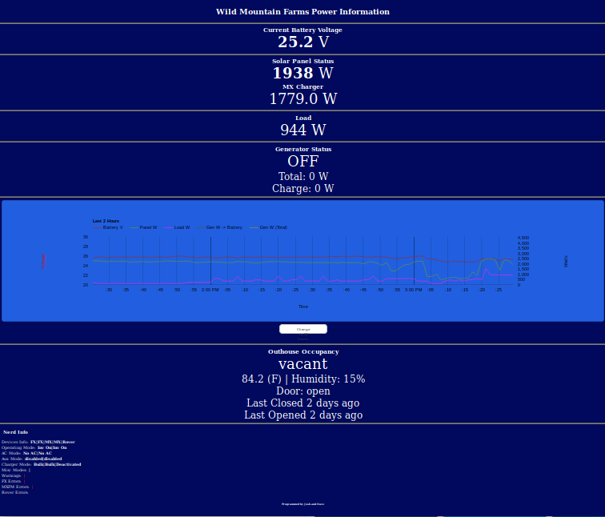

# SolarThing
Parses data from an Outback MATE, communicates with a renogy rover, and uses CouchDB as a database!

## Supported Products
* Communicates with <strong>Outback MATEs</strong> 1/2 via the DB9 serial port. This supports receiving and parsing data from FX's, MX's and FM's
* Communicates with <strong>Renogy Rover</strong> (And other Renogy products) over modbus serial.

## Uses
* Upload data to a database
* Display data in Android Application
* Display data in Web Application
* Use as an API for your own uses!

# Quickstart
Ready to install? Use the [Quickstart](docs/quickstart.md)!

# Why should you use this?
This program supports communication with more solar products than any other open source program. The program
was built to reliably store data in a database while running 24-7. You can customize this program to fit your
needs without programming. But, if you are a programmer, this API will make your life a lot easier.

Out of the box, this supports lots of configuration options. These options include configuring CouchDB, InfluxDB and  local json file exporting. There is
currently three different ways to view the data that is stored in your database of choice.

## What This is currently used for
This program is run on a raspberry pi at Wild Mountain Farms (www.wildmountainfarms.com).
That program uploads packets to a CouchDB database on a separate computer which hosts the web portion
found here: [solarthing-web](https://github.com/wildmountainfarms/solarthing-web). We also use InfluxDB to make using Grafana easy:


In the future, this project may extend to more IoT uses other than just solar and outhouse status. But the name will
forever stick! Long live <strong>SolarThing</strong>!

### Displaying the Data!
SolarThing Android: [Github](https://github.com/wildmountainfarms/solarthing-android)
|
[Google Play](https://play.google.com/store/apps/details?id=me.retrodaredevil.solarthing.android)


<hr/>

[SolarThing Web](https://github.com/wildmountainfarms/solarthing-web)


<hr/>
If you decide to use InfluxDB, you can easily create your own Dashboard with Grafana. This is the most customizable!


<hr/>

### Individual documentation
[Solar readme](solar/README.md)

[Outhouse Status readme](outhouse/README.md)

## Using the program
You can see the [Outback/Renogy Rover](solar/README.md) README for using the program with outback or renogy products.

You can see the [Outhouse](outhouse/README.md) README for using the outhouse program.

The [input and output](docs/input_and_outputs.md) README is documentation for the `io` JSON property option used in all of the sub programs.

### Developer Use
[](https://jitpack.io/#wildmountainfarms/solarthing)

You can import the most current release by using www.jitpack.io. 
* Useful for parsing JSON packets stored in CouchDB. [solarthing-android](https://github.com/wildmountainfarms/solarthing-android) uses this
* You can parse Outback Mate packets directly
* You can read and write to a Renogy Rover easily

Import it like this:
```groovy
allprojects {
    repositories {
        maven { url 'https://www.jitpack.io' }
    }
}
dependencies {
    implementation 'com.github.wildmountainfarms.solarthing:core:<CURRENT VERSION HERE>'
}
```


### [Contributing](CONTRIBUTING.md)

### Compiling
Run `./compile_and_move.sh`.

### Database Setup
[CouchDB setup](docs/couchdb.md)

[InfluxDB setup](docs/influxdb_config.md): (Basically None)<br/>
*Please note that InfluxDB is not supported by the web application or Android application. Use this if you only want to use Grafana*
### [Technical](docs/technical.md)

#### Configuration
This uses all JSON for configuring everything. The files you edit are all in one place unless you decide to move them.

See [Quickstart](docs/quickstart.md) to see how to set them up

#### Logging
This uses slf4j to log and uses log4j2 as the main implementation. https://logging.apache.org/log4j/2.x/manual/appenders.html

### TODO
* Implement Outback FlexNet DC Packets
* Cache some data from Renogy Rover that won't be updated
* Create Arduino program to simulate MATE or Rover
* Log CPU temperature, ram, etc into a database and logs.
  * Use the `vcgencmd measure_temp` available on Raspberry Pis
* Detect when Mate packets go from address 4->1 or 1->1 to detect a new collection of packets
* Integrate power usage
* Have packets for inverters going on/off, AC Drop/AC Use, Daily kWH->0, etc
* Add readable string alongside identifier tag for InfluxDB
* Restart rover program if a ModbusTimeoutException is received
* Create 'exporter' module which will have a Prometheus exporter that runs and gets data from CouchDB
* Create a calendar program to be able to view daily kWH on a calendar interface
* Report hash of the jar file https://stackoverflow.com/questions/20814539/get-checksum-of-a-jar-file

### Completed TODO:
* Provide option/configuration for multiple MATEs (maybe using multiple databases with an id at the end? i.e.: solarthing-1, solarthing-2 or commands-1, commands-2)
    * Done by using fragmented packets. Will be stored in the same database but uses InstancePackets to indicate source and fragment ids
* Add field to MX Status Packet to indicate whether it supports dailyAH and field to indicate the version of the MX or if it is a FM
* Create a PacketHandler that saves json data to a file location that can be easily accessed using a Apache web server
* Add better logging with timestamps
* Make Grafana easy to use by supporting InfluxDB as a database
* Add a basic file for a systemd service
* Stop requiring command line parameters and have option to use all JSON configs

### [History](docs/history.md)

### TODO Look into
* Figure out how to use https://emoncms.org/ to graph data
* Look into supporting Elasticsearch, MongoDB, Graphite, Prometheus
* Log data to https://pvoutput.org
* Do something with https://www.home-assistant.io/ somehow
* Log data to https://solcast.com.au/
* Support freeboard
* Support https://dweet.io
