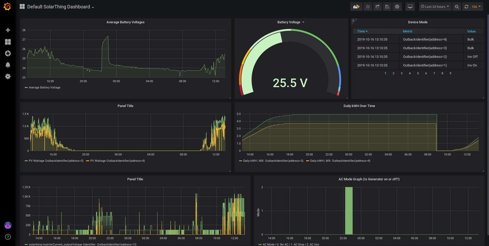

# SolarThing
Parses data from an Outback MATE, communicates with a Renogy Rover - MPPT Charge Controller, uses CouchDB or InfluxDB as a database. Great with Grafana and PVOutput!

## Supported Products
* <strong>Outback MATEs</strong> (FX Inverter, MX/FM Charge Controller)
* <strong>Renogy Rover</strong> (And other Renogy products) over modbus serial.

# Quickstart
Ready to install? Use the [Quickstart](docs/quickstart.md)!

# Features
* Supports **multiple types of solar products** (Outback MX/FM and Renogy Rover + compatible products)
* Runs reliably **24-7**. Recovers from connection errors and has verbose logging features
* Fully customizable through JSON (**No programming experience required**)
* Supports CouchDB, InfluxDB, local JSON file, and PVOutput exporting

## Supported Databases
* CouchDB
  * Allows for [solarthing-web](https://github.com/wildmountainfarms/solarthing-web) and [solarthing-android](https://github.com/wildmountainfarms/solarthing-android) to function
  * Used for PVOutput data collection
* InfluxDB
  * Allows for viewing of data in Grafana
* [PVOutput.org](https://pvoutput.org)
  * Allows for viewing of data on [pvoutput.org](https://pvoutput.org)
  * Requires CouchDB to be set up

### Examples
SolarThing Android: [Github](https://github.com/wildmountainfarms/solarthing-android)
|
[Google Play](https://play.google.com/store/apps/details?id=me.retrodaredevil.solarthing.android)

[SolarThing Web](https://github.com/wildmountainfarms/solarthing-web)

If you decide to use InfluxDB, you can easily create your own Dashboard with Grafana. This is the most customizable!

## What This is currently used for
This program is run on a raspberry pi at Wild Mountain Farms.
That program uploads packets to a CouchDB database on a separate computer which hosts the web portion
found here: [solarthing-web](https://github.com/wildmountainfarms/solarthing-web) CouchDB is also used for [solarthing-android](https://github.com/wildmountainfarms/solarthing-android). 
We use InfluxDB to make using Grafana easy. We run the `pvoutput-upload` subprogram to upload CouchDB data to [pvoutput.org](https://pvoutput.org)

## Using the program
You can see the [Outback/Renogy Rover](solar/README.md) README for using the program with outback or renogy products.

The [input and output](docs/input_and_outputs.md) README is documentation for the `io` JSON property option used in all of the sub programs.

### Compiling
Run `./compile_and_move.sh`.

### Database Setup
[CouchDB setup](docs/couchdb.md) 
*Used for the android and web application*

[InfluxDB setup](docs/influxdb_config.md) 
*Used for Grafana*

#### [Developer Use](docs/developer_use.md)
#### [Contributing](CONTRIBUTING.md)
#### [Technical](docs/technical.md)
#### [Project Structure](docs/project_structure.md)
#### [History](docs/history.md)

#### Configuration
This uses all JSON for configuring everything. The files you edit are all in one place unless you decide to move them.

See [Quickstart](docs/quickstart.md) to see how to set them up
